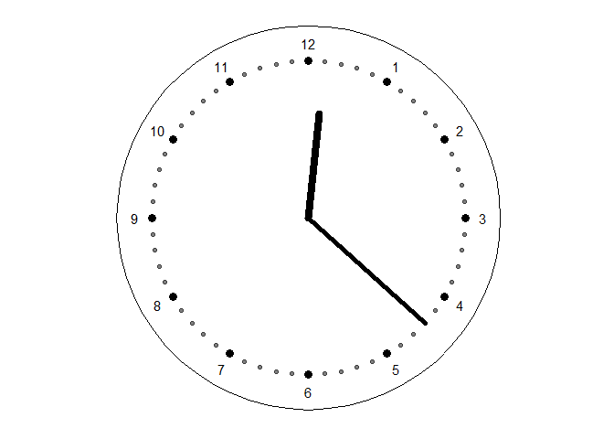
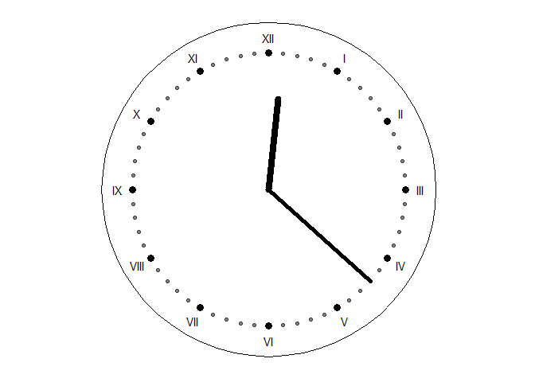
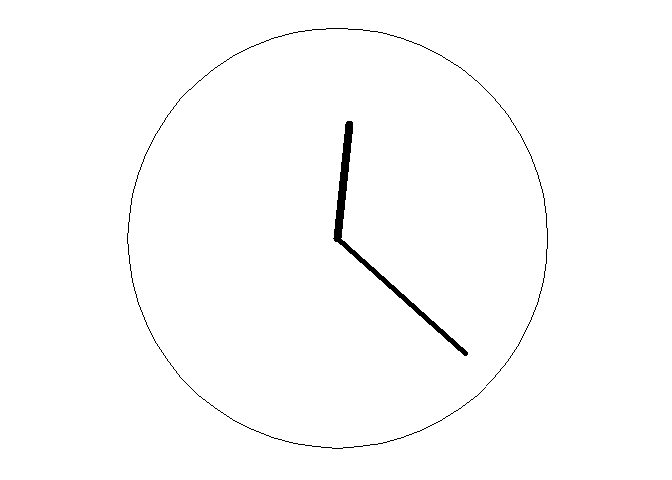
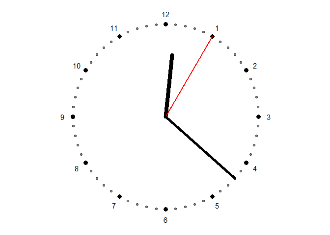
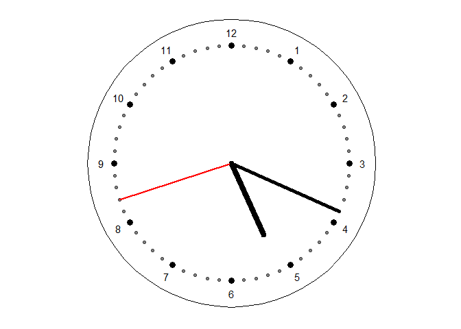
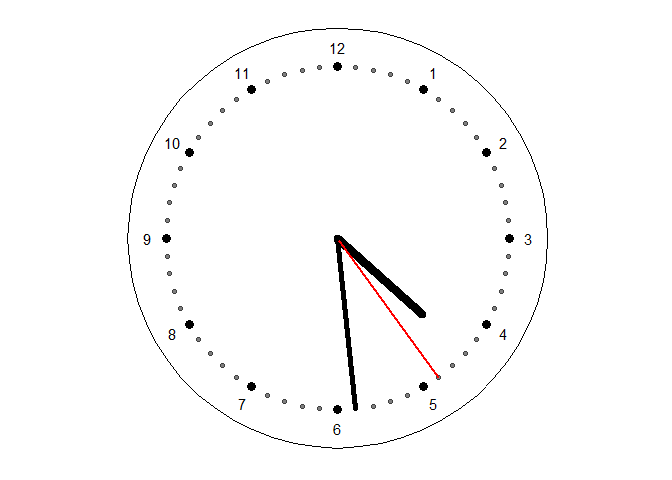

# clockPlot

clockPlot makes use of ggplot to create a clock face graphic for visual
purposes. This could then be saved and used as a visual aid in a
document or in print.

## Installation

This package can be installed from [GitHub](https://github.com/) with:

``` r
# install.packages("devtools")
devtools::install_github("zwarham/clockPlot")
```

## Examples

Make sure to load package prior to running these examples.

``` r
library(clockPlot)
## basic example code
```

### 1. Produce a default clockPlot from a single value

A default clockPlot will show the following features: \* Hour and minute
hands \* Minute intervals \* Enlarged, hour intervals \* Numeric labels
for each hour \* A border

``` r
#Produce a default clockPlot

#Assign a time in the POSIX format to a value. The date is required in POSIX but is ignored in a clockPlot
someTimeValue <- Sys.time()

#Parse the value to the clockPlot() function
clockPlot(time = someTimeValue)
```



### 2. Customise the look of your clockPlot

clockPlot allows for various means of customisation: \* secondHand -
defaults to false, set to true to show a red secondhand \* labels - can
show *none*, *numeric* (default) or *roman numerals* \* minuteMarks -
defaults to TRUE, set to false to hide minute intervals \* hourMarks -
defaults to TRUE, set to false to hide the hour intervals \* border -
defaults to TRUE, set to false to hide the border

Here a few examples with varying options (not an exhaustive list of
option combinations)

``` r
#Produce clockPlot's with differrent views

#Assign a time in the POSIX format to a value. The date is required in POSIX but is ignored in a clockPlot
someTimeValue <- Sys.time()

#Default with roman numerals
clockPlot(someTimeValue, labels = "roman")
#> Warning: Use of `hour_labels$roman` is discouraged. Use `roman` instead.
```



``` r
#Minimal view (only the two hands and border)
clockPlot(someTimeValue, labels = "none", minuteMarks = FALSE, hourMarks = FALSE)
```



``` r
#Remaining options
clockPlot(someTimeValue, secondHand = TRUE, border = FALSE)
```



### 3. Parsing a tibble of values

Occasionally you may want to produce a series of clockPlots, for example
if you are printing off multiple versions for a student worksheet. Here
are some examples of how to do so.

Notes: \* All clockPlots will have the same options \* You must specify
the name of the column inside the tibble \* This is using the *column*
argument \* clockPlots are added to the *clockPlots* column at the front
of the tibble parsed \* View clockPlot using
clockPlots\[\[column\]\]\[\[row\]\] \* column will be 1 by default
People

``` r
#Produce clockPlots from a tibble

#Create a tibble of times. Sample() used to show that they are different plots
tibbleTime <- tibble::tibble(times = Sys.time() - sample(1:100000, 50))

#Create default clockPlots + second hands
clockPlots <- clockPlot(tibbleTime, column = "times", secondHand = TRUE)

#View some of the clockPlots
clockPlots[[1]][[1]]
```



``` r
clockPlots[[1]][[37]]
```


``` r
clockPlots[[1]][[21]]
```


